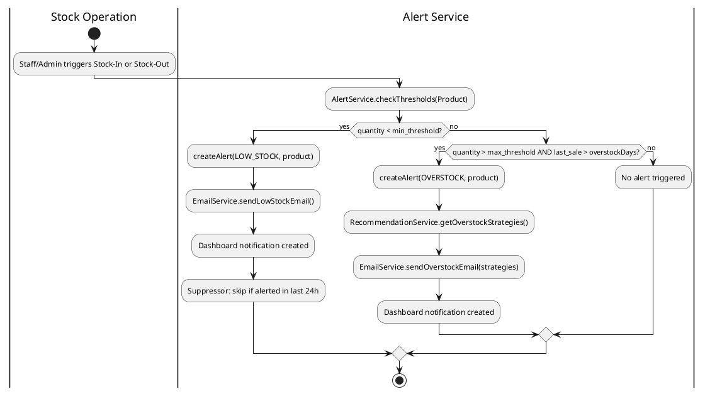
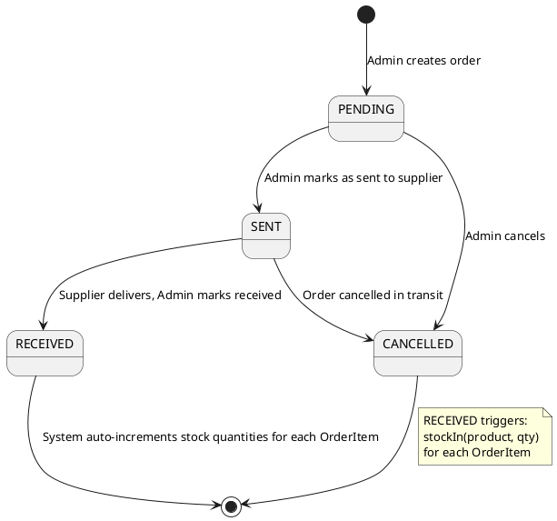
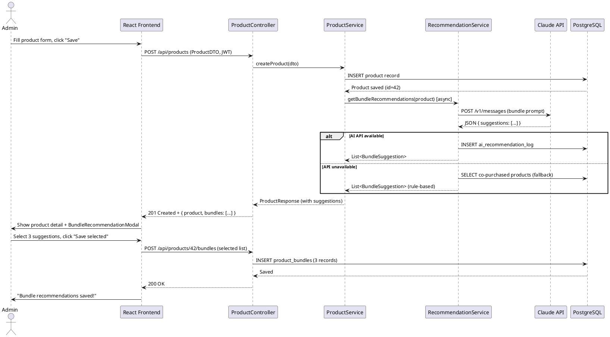

# WMS-AI: UML & Use Case Diagrams
## UML_Diagrams.md — v1.0
**Date:** March 28, 2026 | **Supervised by:** CODEX

---

## 1. Diagram Index

| # | Diagram | Type | Coverage |
|---|---------|------|----------|
| D1 | Use Case Diagram | UML Use Case | All actors, system boundary, 12 use cases |
| D2 | Class Hierarchy Diagram | UML Class | Inheritance tree + entity relationships |
| D3 | Activity Flow (text) | UML Activity | Alert trigger flow |
| D4 | State Diagram (text) | UML State | Purchase Order lifecycle |
| D5 | Sequence Diagram (text) | UML Sequence | AI recommendation sequence |

> D1 and D2 are rendered as SVG visuals in the chat.
> D3–D5 are described in PlantUML notation below.

---

## 2. Use Case Diagram Summary

**Actors:** Admin, Staff

**Shared Use Cases (both actors):**
- Login
- Manage products (CRUD, stock in/out)
- Record sales
- View analytics
- View dashboard
- Stock in / out

**Admin-only Use Cases:**
- System settings (configure thresholds, overstock days)
- Manage users (create/deactivate Staff accounts)
- Create purchase orders
- Manage alerts (view, dismiss, act on AI recommendations)
- AI recommendations (trigger + save bundle suggestions)
- Export / import files (CSV)

**Key relationships:**
- "Create purchase orders" `<<include>>` "Manage suppliers" (supplier must exist)
- "Manage alerts" `<<extend>>` "Get AI tips" (optional AI tips on overstock alert)
- "Record sales" `<<include>>` "Stock in / out" (always decrements stock)

---

## 3. Class Hierarchy Summary

### Inheritance Tree
```
«interface» Searchable
     ▲ (implements — dashed arrow)
     │
«abstract» Person
  - id: int
  - name: String
  - email: String
     ▲ (extends — solid arrow)
     │
   Employee
  - employeeId: String
  - role: Role (enum)
  + searchById(int): Employee    ← overrides Aadhaar search with Employee ID
  + searchByName(String): Employee
     ├──────────────────────────┐
     ▲                          ▲
  AdminUser                  StaffUser
  role = ADMIN               role = STAFF

(Supplier also implements Searchable — separate branch)
```

### Key Entity Associations
```
Product ──── N:1 ──── Category
Product ──── N:1 ──── Supplier

PurchaseOrder ──◆── 1..* ──── OrderItem ──── N:1 ──── Product
                (composition)

SalesTransaction ──── N:1 ──── Product

Alert ──── refs ──── Product

AIRecommendationLog ──── refs ──── Product
ProductBundle ──── refs ──── Product
```

---

## 4. Activity Diagram — Alert Trigger Flow (PlantUML)



---

## 5. State Diagram — Purchase Order Lifecycle (PlantUML)



---

## 6. Sequence Diagram — AI Bundle Recommendation Flow (PlantUML)



---

## 7. OOPJ Diagram Coverage

| OOPJ Requirement | Diagram Type | Where Shown |
|-----------------|-------------|-------------|
| Class, Object, Activity diagrams | Class + Activity | D2, D3 |
| State diagram | State | D4 |
| Interaction diagram (Sequence) | Sequence | D5 |
| Use case diagram | Use Case | D1 |
| Aggregation | Class (OrderItem in Order) | D2 |
| Composition | Class (◆ diamond on Order) | D2 |
| Association | Class (Product–Category, etc.) | D2 |
| Inheritance | Class (Person hierarchy) | D2 |
| Interface | Class (Searchable) | D2 |
| Encapsulation | Class (private fields shown) | D2 |
